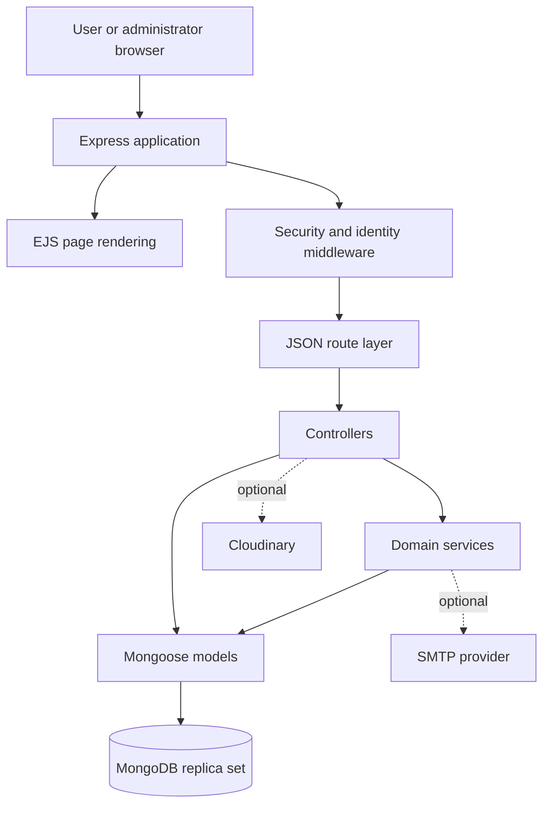
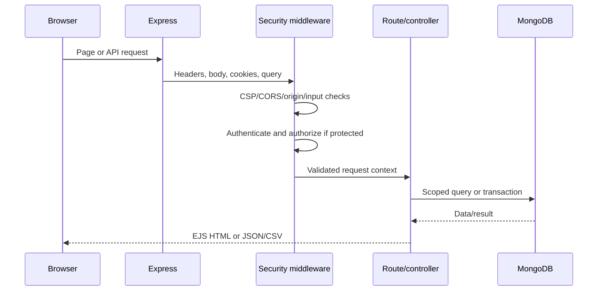
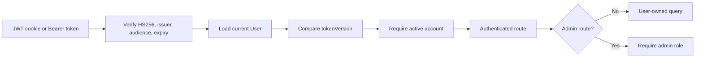

# System architecture

## Overview

QuizMaster Pro is a modular monolith. One Node.js process serves EJS pages, static browser assets, and JSON APIs. MongoDB is the system of record; SMTP and Cloudinary are optional external integrations.

## Backend responsibilities

| Layer         | Location              | Responsibility                                                                                              |
| ------------- | --------------------- | ----------------------------------------------------------------------------------------------------------- |
| Composition   | `server/app.js`       | Middleware order, static files, page maps, and API mounts                                                   |
| Routes        | `server/routes/`      | HTTP methods, paths, and auth/admin middleware contracts                                                    |
| Controllers   | `server/controllers/` | Input validation, request coordination, queries, and responses                                              |
| Services      | `server/services/`    | Reusable achievements, notifications, daily challenge, email, rank, level, settings, and activity workflows |
| Models        | `server/models/`      | Schemas, validation, sensitive-field defaults, methods, and indexes                                         |
| Middleware    | `server/middleware/`  | Authentication, authorization, request security, limits, uploads, and error translation                     |
| Utilities     | `server/utils/`       | JWT/cookie behavior, normalization, pagination, safe search, URLs, and CSV encoding                         |
| Configuration | `server/config/`      | Environment, MongoDB, and Cloudinary setup                                                                  |

Controllers keep the multi-model quiz transaction together because its atomic boundary crosses sessions, scores, users, daily completion, achievements, and notifications.

## Request lifecycle

Public pages are rendered without authentication. Learner pages use `protect`; administrator pages apply `protect` followed by `adminOnly`. API routers follow the same policy.

## Frontend architecture

- `client/views/` contains page documents and navbar/footer partials.
- `client/js/` contains page-specific vanilla JavaScript and small shared utilities.
- `client/css/` contains variables, shared foundations, feature styles, administrator styles, animations, and responsive rules.

There is no frontend bundler or framework. Express serves assets directly with ETags and a one-hour production cache; rendered HTML uses `Cache-Control: no-store`.

Dynamic content should use DOM APIs and `textContent` where practical. Existing template construction escapes dynamic values and operates under the application's CSP.

## Authentication boundary

Password changes/resets and administrator role/status changes increment the user's token version, invalidating older tokens.

## Deployment model

The current implementation targets a single locally managed Node.js process and MongoDB replica set. Production mode expects:

- matching HTTPS `APP_ORIGIN` and `CLIENT_ORIGIN`;
- a strong JWT secret;
- proxy awareness (`trust proxy = 1`);
- secure cookies and HSTS;
- external SMTP/Cloudinary configuration only when those features are used.

Horizontal scaling requires additional design work for shared rate-limit state and should consider analytics rollups, streamed reports, and cursor pagination.

## Testing architecture

| Suite                   | Role                                                                                        |
| ----------------------- | ------------------------------------------------------------------------------------------- |
| Jest unit/contract      | Utilities, middleware behavior, views, routes, frontend foundations                         |
| MongoDB integration     | Authentication, ownership, features, active-question behavior                               |
| Replica-set integration | Transactions, rollback, replay, and concurrency                                             |
| Playwright              | Desktop/mobile rendering, hydration, failures, responsive behavior, keyboard, and structure |

Tests use isolated temporary databases and synthetic browser fixtures. External email and avatar providers are not contacted by automated tests.
