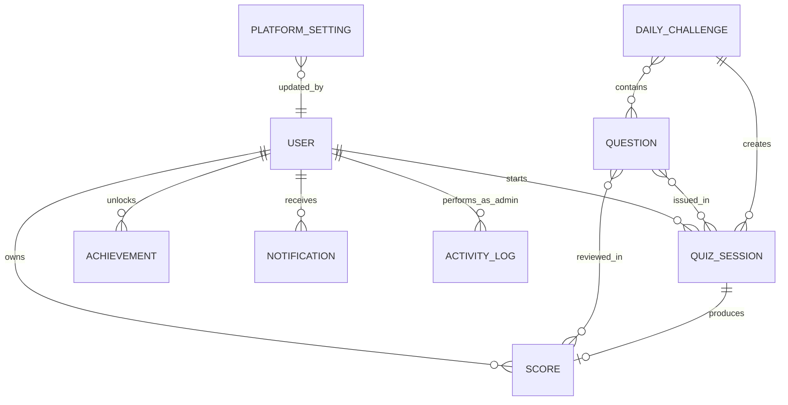
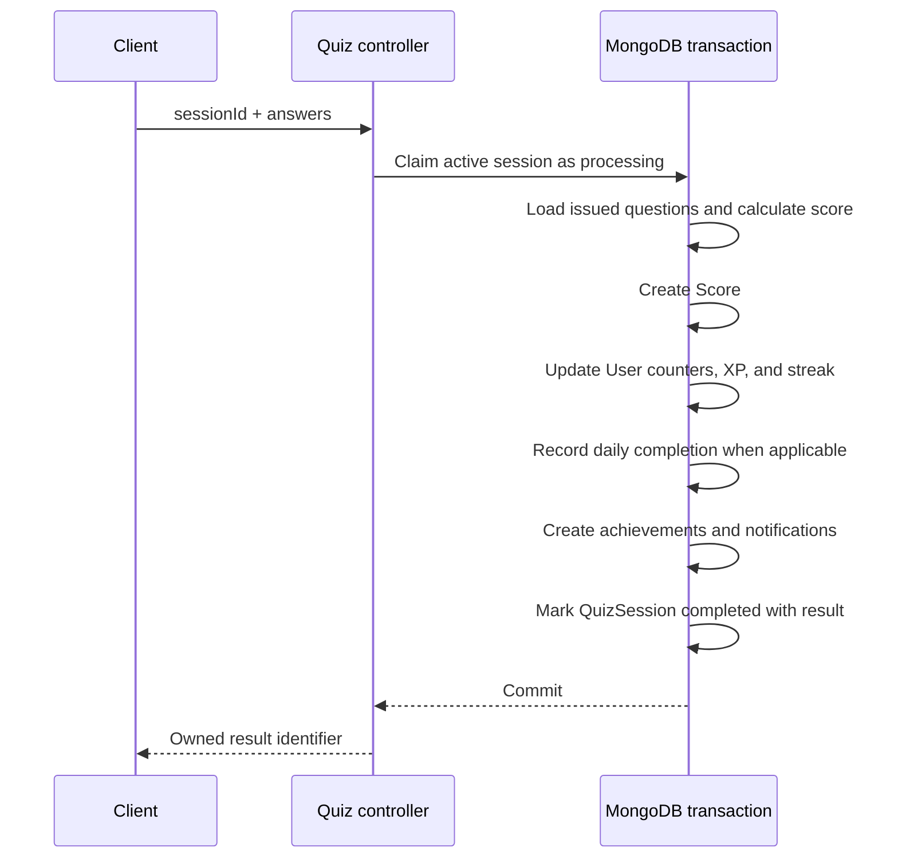

# Database design

QuizMaster Pro uses MongoDB through Mongoose. Quiz completion requires a replica set because one completion updates multiple collections inside a transaction.

## Entity relationships

## Collections

### User

Stores identity, authorization, authentication state, and denormalized progress counters.

| Field group    | Important fields                                                                 |
| -------------- | -------------------------------------------------------------------------------- |
| Identity       | `firstName`, `lastName`, unique lowercase `email`, `avatar`                      |
| Authentication | bcrypt `password`, `tokenVersion`, verification/reset hashes and expirations     |
| Authorization  | `role` (`user` or `admin`), `isActive`                                           |
| Progress       | `totalXp`, `quizzesCompleted`, `correctAnswers`, `currentStreak`, `lastQuizDate` |
| Audit          | `lastLoginAt`, timestamps                                                        |

Passwords and token hashes use `select: false`. Passwords are hashed with bcrypt using 12 salt rounds before save.

### Question

Stores question text, exactly four options, a zero-based `correctAnswer`, category, difficulty (`Easy`, `Medium`, or `Hard`), optional explanation, and active status. Newly issued quizzes exclude inactive questions; already-issued and historical attempts remain reviewable.

### QuizSession

The server-authoritative attempt record.

| Field                    | Purpose                                                        |
| ------------------------ | -------------------------------------------------------------- |
| `sessionId`              | Unique immutable 32-byte base64url identifier                  |
| `user`                   | Owning user                                                    |
| `category`, `questions`  | Immutable issued content                                       |
| `mode`                   | `standard` or `daily`                                          |
| `dailyChallenge`         | Required only for daily sessions                               |
| `startedAt`, `expiresAt` | Validity window                                                |
| `status`                 | `active`, `processing`, `completed`, `expired`, or `cancelled` |
| `result`                 | Score created by successful completion                         |

### Score

Stores the historical result, owning user, unique quiz-session reference, category, per-question selected/correct answers, totals, accuracy, XP earned, duration, and completion time. Results retain correct-answer information for owned historical review.

### DailyChallenge

Stores one unique `dateKey`, challenge metadata, question IDs, question count, XP/badge reward, availability window, active status, and embedded completion summaries. This embedded completion design is suitable for the current portfolio scale but should be revisited for high-volume deployments.

### Supporting collections

| Collection        | Purpose                                                                 |
| ----------------- | ----------------------------------------------------------------------- |
| `Achievement`     | Per-user unlocked achievement; unique by user and code                  |
| `Notification`    | Owned quiz, achievement, XP, streak, account, or system messages        |
| `ActivityLog`     | Administrator action, entity, description, metadata, IP, and user agent |
| `PlatformSetting` | Typed, categorized setting with a unique lowercase key                  |

## Transactional quiz completion

If any transactional write fails, the transaction aborts. Unique indexes on `Score.quizSession`, `QuizSession.result`, and daily user/challenge sessions provide additional replay protection.

## Important indexes

| Collection      | Index purpose                                                                                       |
| --------------- | --------------------------------------------------------------------------------------------------- |
| User            | Unique email and ordered active-user leaderboard                                                    |
| QuizSession     | Unique session ID, active-session expiry, user recency, result uniqueness, daily-session uniqueness |
| Score           | User history, category scores, unique session result                                                |
| DailyChallenge  | Unique date and user/date completion lookup                                                         |
| Achievement     | Unique user/code unlock                                                                             |
| Notification    | User recency and unread feeds                                                                       |
| ActivityLog     | Administrator/action/entity/date filtering                                                          |
| PlatformSetting | Unique key and category/key lookup                                                                  |

Indexes should be reviewed against representative `explain("executionStats")` output before adding more; each index increases storage and write cost.

## Data lifecycle and consistency

- Normal startup never deletes or reseeds data.
- `npm run seed:questions` is non-destructive when questions exist.
- `npm run reset:questions` deliberately replaces question data and is for disposable environments.
- Questions referenced by saved results cannot be deleted through the administrator API.
- User-owned reads include the authenticated user in their query filter.
- No automatic archival or TTL deletion policy is currently implemented.

## Scale considerations

- Deep lists use offset pagination.
- Administrator analytics include collection-wide aggregations.
- CSV reports are buffered in memory.
- Daily challenge completions are embedded in a per-day document. Writes stop when the 24-hour challenge expires, so a document does not grow across days; the design remains suitable for portfolio-scale usage and should move to a dedicated collection before high-volume public operation.
- Regex administrator search does not behave like a dedicated search index.

These are documented deployment limits, not evidence of incorrect behavior at the project's intended local scale.
