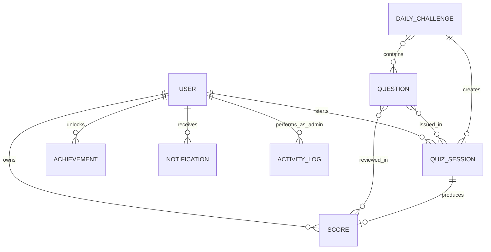
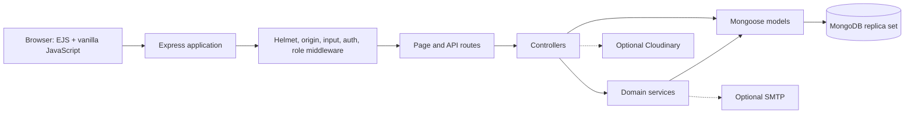

<div align="center">

# QuizMaster Pro

### Learn. Compete. Improve.

A secure, full-stack quiz platform with server-authoritative quizzes, learner progress systems, personal analytics, and a complete administrator experience.

[](https://nodejs.org/)
[](https://expressjs.com/)
[](https://www.mongodb.com/)
[](#testing)
[](LICENSE)

[GitHub Pages showcase](https://ashish-vision.github.io/QuizMaster-Pro/) · [Installation](#installation) · [API](#api-overview) · [Architecture](#architecture) · [Contributing](#contributing)

</div>

> **Project status:** local v1.0.0 release candidate. QuizMaster Pro is a portfolio project and is not presented as a hosted public service.

## Table of contents

- [Project overview](#project-overview)
- [Key features](#key-features)
- [Screenshots](#screenshots)
- [Technology stack](#technology-stack)
- [Folder structure](#folder-structure)
- [Installation](#installation)
- [Environment variables](#environment-variables)
- [Usage](#usage)
- [API overview](#api-overview)
- [Database schema](#database-schema)
- [Architecture](#architecture)
- [Security features](#security-features)
- [Testing](#testing)
- [Future roadmap](#future-roadmap)
- [Contributing](#contributing)
- [License](#license)
- [Author](#author)

## Project overview

QuizMaster Pro is a server-rendered Node.js application built with Express, EJS, vanilla JavaScript, and MongoDB. It combines account management, category-based quizzes, daily challenges, progress tracking, personal analytics, and administrator tooling in one modular application.

Quiz integrity is enforced by the server. Starting a quiz creates an opaque, expiring session containing the immutable question set. Submission is scored against that session inside a MongoDB transaction so results, XP, counters, daily completion, achievements, notifications, and session state succeed or fail together.

The frontend has no framework or compilation step. Express renders semantic EJS pages and serves page-specific JavaScript and responsive CSS directly.

## Key features

### Learner experience

- Registration, email verification, login, logout, and password recovery
- Category-based quizzes using expiring, server-issued sessions
- Daily challenges with configured XP and badge rewards
- Owned result review and paginated quiz history
- XP, levels, streaks, achievements, and notifications
- Leaderboard and personal performance analytics
- Profile information, avatar upload/removal, and account settings
- Responsive desktop and mobile interface

### Administrator experience

- Platform dashboard and analytics
- Question creation, editing, activation, and safe deletion
- Category statistics, renaming, and guarded deletion
- User search, role changes, and account-status management
- Quiz-attempt inspection and controlled deletion
- Achievement statistics and details
- Notification creation and management
- CSV reports with spreadsheet-safe encoding
- Platform settings and administrator activity logs

### Quality and integrity

- Transactional, replay-safe quiz submission
- Active-question enforcement with historical-result compatibility
- Explicit learner, owner, and administrator authorization boundaries
- Loading, empty, validation, and error states
- Keyboard-aware navigation and dialogs
- Desktop and mobile Chromium audits

## Screenshots

Screenshots are intentionally represented by placeholders until reviewed images are captured from a local session using synthetic data.

| Learner experience                                                       | Administrator experience                                                             |
| ------------------------------------------------------------------------ | ------------------------------------------------------------------------------------ |
| **Login placeholder**<br>`docs/images/screenshots/login.png`             | **Admin dashboard placeholder**<br>`docs/images/screenshots/admin-dashboard.png`     |
| **Dashboard placeholder**<br>`docs/images/screenshots/dashboard.png`     | **Admin analytics placeholder**<br>`docs/images/screenshots/admin-analytics.png`     |
| **Quiz placeholder**<br>`docs/images/screenshots/quiz.png`               | **Question management placeholder**<br>`docs/images/screenshots/admin-questions.png` |
| **Result placeholder**<br>`docs/images/screenshots/result.png`           | **User management placeholder**<br>`docs/images/screenshots/admin-users.png`         |
| **Leaderboard placeholder**<br>`docs/images/screenshots/leaderboard.png` | **Attempt management placeholder**<br>`docs/images/screenshots/admin-attempts.png`   |

See [the screenshot guide](docs/SCREENSHOT_GUIDE.md) before adding images. Never capture real credentials, tokens, email addresses, or private user data.

## Technology stack

| Area             | Technology                                               |
| ---------------- | -------------------------------------------------------- |
| Runtime          | Node.js 22+                                              |
| Server           | Express 5, CommonJS                                      |
| Rendering        | EJS                                                      |
| Browser          | HTML, CSS, vanilla JavaScript                            |
| Database         | MongoDB, Mongoose                                        |
| Authentication   | JSON Web Tokens, bcrypt, HttpOnly cookies                |
| Security         | Helmet, CSP, CORS, express-rate-limit, request hardening |
| Email            | Nodemailer with optional SMTP configuration              |
| Avatar storage   | Optional Cloudinary integration                          |
| Unit/API testing | Jest, Supertest                                          |
| Database testing | mongodb-memory-server and replica-set fixtures           |
| Browser testing  | Playwright with desktop and Pixel 7 profiles             |
| Code quality     | ESLint, Prettier, npm audit                              |

## Folder structure

```text
QuizMaster-Pro/
├── client/
│   ├── css/                 # Shared, feature, responsive, and admin styles
│   ├── js/                  # Page-specific browser behavior
│   │   └── admin/           # Administrator page scripts
│   └── views/               # EJS pages and shared partials
├── server/
│   ├── config/              # Environment, MongoDB, and Cloudinary setup
│   ├── controllers/         # HTTP request coordination
│   ├── database/            # Bundled questions and seed/reset commands
│   ├── middleware/          # Authentication, authorization, security, uploads
│   ├── models/              # Mongoose schemas, validation, and indexes
│   ├── routes/              # Page and JSON API contracts
│   ├── services/            # Reusable domain workflows
│   ├── utils/               # JWT, CSV, URL, pagination, and input helpers
│   ├── app.js               # Express composition
│   └── server.js            # Environment, database, and HTTP startup
├── tests/                   # Jest unit, contract, security, and integration tests
├── e2e/                     # Playwright desktop/mobile audits
├── docs/                    # Showcase and supporting technical documentation
├── scripts/                 # Local verification utilities
├── .env.example             # Safe environment template
├── package.json             # Dependencies and project commands
└── README.md
```

## Installation

### Prerequisites

- Node.js 22 or newer
- npm
- MongoDB configured as a replica set
- Chromium when running Playwright tests

MongoDB transactions are required for quiz completion. A standalone MongoDB instance is insufficient for the complete workflow.

### Setup

```bash
git clone https://github.com/Ashish-Vision/QuizMaster-Pro.git
cd QuizMaster-Pro
npm ci
cp .env.example .env
```

Configure `.env`, start your MongoDB replica set, and optionally seed the bundled questions:

```bash
npm run seed:questions
npm run dev
```

Open `http://localhost:5000`.

For database setup, production validation, troubleshooting, and first-administrator instructions, see [INSTALLATION.md](INSTALLATION.md).

## Environment variables

### Required and core variables

| Variable         | Required   | Description                                                   |
| ---------------- | ---------- | ------------------------------------------------------------- |
| `NODE_ENV`       | Yes        | Runtime mode, normally `development`, `test`, or `production` |
| `PORT`           | No         | HTTP port; defaults to `5000`                                 |
| `MONGODB_URI`    | Yes        | MongoDB replica-set connection URI                            |
| `JWT_SECRET`     | Yes        | Random JWT secret of at least 32 bytes                        |
| `JWT_EXPIRES_IN` | No         | JWT lifetime; defaults to `7d`                                |
| `JWT_ISSUER`     | No         | Expected JWT issuer; defaults to `quizmaster-pro`             |
| `JWT_AUDIENCE`   | No         | Expected JWT audience; defaults to `quizmaster-pro-users`     |
| `APP_ORIGIN`     | Production | Canonical application origin; HTTPS is required in production |
| `CLIENT_ORIGIN`  | Production | Allowed browser origin; must match `APP_ORIGIN` in production |

### Optional integrations

| Group                  | Variables                                                                                                      |
| ---------------------- | -------------------------------------------------------------------------------------------------------------- |
| SMTP                   | `SMTP_HOST`, `SMTP_PORT`, `SMTP_SECURE`, `SMTP_USER`, `SMTP_PASSWORD`, `EMAIL_FROM_NAME`, `EMAIL_FROM_ADDRESS` |
| Local recovery testing | `EXPOSE_DEVELOPMENT_RESET_URL`                                                                                 |
| Cloudinary             | `CLOUDINARY_CLOUD_NAME`, `CLOUDINARY_API_KEY`, `CLOUDINARY_API_SECRET`                                         |
| MongoDB test binary    | `MONGOMS_SYSTEM_BINARY`                                                                                        |

Minimal local example:

```dotenv
NODE_ENV=development
PORT=5000
MONGODB_URI=mongodb://127.0.0.1:27017/quizmaster_pro?replicaSet=rs0
JWT_SECRET=replace-with-at-least-32-random-bytes
JWT_EXPIRES_IN=7d
JWT_ISSUER=quizmaster-pro
JWT_AUDIENCE=quizmaster-pro-users
APP_ORIGIN=http://localhost:5000
CLIENT_ORIGIN=http://localhost:5000
```

Never commit `.env` or real credentials. The full variable reference is available in [INSTALLATION.md](INSTALLATION.md).

## Usage

### Learner workflow

1. Register an account.
2. Verify the email address using the configured email flow.
3. Log in and open the dashboard.
4. Start a category quiz or the current daily challenge.
5. Submit answers and review the owned result.
6. Track history, rank, analytics, XP, streaks, achievements, and notifications.
7. Manage profile and account settings.

### Administrator workflow

The application intentionally has no public administrator-creation endpoint. Promote a verified local user directly in MongoDB, then log in again so authorization uses a fresh token.

Administrators can use the protected interface to review analytics and activity, manage quiz content and users, inspect attempts, create notifications, export reports, and adjust platform settings.

### Common commands

| Command                   | Purpose                                           |
| ------------------------- | ------------------------------------------------- |
| `npm run dev`             | Start with Nodemon                                |
| `npm start`               | Start normally with Node.js                       |
| `npm run seed:questions`  | Seed an empty question collection                 |
| `npm run reset:questions` | Replace question data in a disposable environment |
| `npm run check`           | Run syntax, lint, formatting, and Jest checks     |
| `npm run test:e2e`        | Run Playwright desktop/mobile checks              |
| `npm run audit:prod`      | Audit production dependencies                     |

## API overview

Protected endpoints accept the HttpOnly authentication cookie or a Bearer token. Administrator APIs require the current user to have the `admin` role.

| Area                  | Representative endpoints                                                                                                                   |
| --------------------- | ------------------------------------------------------------------------------------------------------------------------------------------ |
| Authentication        | `POST /api/auth/register`, `POST /api/auth/login`, `POST /api/auth/logout`, `GET /api/auth/me`                                             |
| Verification/recovery | `/api/email-verification/*`, `/api/password-reset/*`                                                                                       |
| Quiz                  | `GET /api/quiz/categories`, `GET /api/quiz/start/:category`, `POST /api/quiz/submit`, `GET /api/quiz/result/:resultId`                     |
| Daily challenge       | `GET /api/daily-challenge`, `POST /api/daily-challenge/:challengeId/start`                                                                 |
| Learner data          | `/api/history`, `/api/leaderboard`, `/api/analytics`, `/api/achievements`                                                                  |
| Account               | `/api/profile`, `/api/settings`, `/api/notifications`                                                                                      |
| Administration        | `/api/admin/dashboard`, `/api/admin/analytics`, `/api/admin/users`, `/api/admin/questions`, `/api/admin/categories`, `/api/admin/attempts` |
| Operations            | `GET /api/health`, `GET /api/ready`                                                                                                        |

Example quiz submission:

```bash
curl -b cookies.txt -X POST http://localhost:5000/api/quiz/submit \
  -H 'Content-Type: application/json' \
  -d '{
    "quizSessionId":"opaque-server-issued-id",
    "answers":[
      {"questionId":"64b000000000000000000031","selectedAnswer":2}
    ]
  }'
```

See [API.md](API.md) for endpoint tables, access requirements, status codes, and additional examples.

## Database schema

QuizMaster Pro currently uses nine Mongoose models.

| Model             | Purpose                                                                  |
| ----------------- | ------------------------------------------------------------------------ |
| `User`            | Identity, credentials, role/status, token version, and progress counters |
| `Question`        | Four-option categorized quiz content and correct answer                  |
| `QuizSession`     | Immutable server-issued question set and attempt lifecycle               |
| `Score`           | Owned historical result and answer review data                           |
| `DailyChallenge`  | Daily question set, reward metadata, and completion summaries            |
| `Achievement`     | Unique per-user achievement unlocks                                      |
| `Notification`    | Owned application notifications and read state                           |
| `ActivityLog`     | Administrator actions and request context                                |
| `PlatformSetting` | Typed, categorized platform configuration                                |



See [DATABASE.md](DATABASE.md) for fields, relationships, indexes, lifecycle rules, and scale considerations.

## Architecture

QuizMaster Pro is a modular monolith with explicit HTTP, domain, persistence, and trust boundaries.



Detailed request, authentication, transaction, deployment, and testing diagrams are in [ARCHITECTURE.md](ARCHITECTURE.md).

## Security features

- bcrypt password hashing with 12 salt rounds
- HS256 JWT validation with issuer, audience, expiry, and per-user token version
- Session revocation after password, role, and account-status changes
- HttpOnly, SameSite cookies and Secure cookies in production
- Current-user ownership filters and fresh administrator role validation
- Helmet headers, CSP, production HSTS, and frame denial
- CORS allowlisting and exact-origin mutation checks
- MongoDB operator/dotted-key input rejection and bounded request bodies
- Rate limiting on authentication, recovery, verification, and sensitive settings routes
- Hashed, expiring, single-use verification and recovery tokens
- Avatar signature, format, structure, dimension, pixel, and size checks
- Same-origin notification-link validation
- Spreadsheet-formula-safe CSV encoding
- Safe production errors without stack disclosure

Read [SECURITY.md](SECURITY.md) for the security model, reporting process, and deployment limitations.

## Testing

The validated project baseline is:

- **232 Jest tests** across 11 suites
- **28 Playwright checks** across desktop Chrome and Pixel 7 profiles
- **0 known production dependency vulnerabilities** at the latest recorded audit
- **59.48% statements**, **38.89% branches**, **53.77% functions**, and **59.48% lines** in the latest coverage run

| Test layer              | Coverage                                                                                              |
| ----------------------- | ----------------------------------------------------------------------------------------------------- |
| Unit and contract       | Utilities, security helpers, middleware, routes, views, browser foundations                           |
| MongoDB integration     | Authentication, ownership, recovery, platform features, question policy                               |
| Replica-set integration | Quiz transactions, rollback, replay, and concurrency                                                  |
| Browser                 | Public/user/admin pages, hydration, error handling, overflow, keyboard behavior, accessible structure |

Run the quality gates:

```bash
npm run check
npm run test:integration
npm run test:e2e
npm run audit:prod
```

Automated browser coverage currently targets Chromium. SMTP, Cloudinary, screen-reader sessions, and a real deployment require separate manual or integration verification.

## Future roadmap

Planned release work is limited to completion and presentation tasks already identified by the project:

- Capture reviewed learner and administrator screenshots
- Record a short application walkthrough
- Complete social-preview and repository presentation assets
- Add Firefox/WebKit and dedicated assistive-technology testing where supported
- Expand direct coverage of large administrator/profile controllers
- Evaluate cursor pagination, streamed reports, and analytics rollups when measured scale requires them
- Add a shared rate-limit store before multi-instance deployment
- Consider avatar decode/re-encode and metadata stripping as defense in depth

See [ROADMAP.md](ROADMAP.md) for release gates, triggers, and explicit non-goals.

## Contributing

Focused contributions are welcome when they preserve server-authoritative scoring, transaction safety, ownership boundaries, accessibility, and the existing Express/EJS architecture.

Before opening a pull request:

```bash
npm run check
npm run test:e2e
npm run audit:prod
```

Bug fixes should include regression coverage. Visual changes should include reviewed desktop/mobile screenshots. Never commit `.env`, credentials, tokens, real user data, coverage output, browser reports, or local database files.

Read [CONTRIBUTING.md](CONTRIBUTING.md) for branching, commit, database, testing, documentation, and review standards.

## License

Copyright © 2026 Ashish-Vision. All rights reserved.

The repository is marked `UNLICENSED`. Source is available for viewing and portfolio evaluation, but permission to use, copy, modify, distribute, sublicense, or sell it is not granted without prior written permission. See [LICENSE](LICENSE).

## Author

**Ashish-Vision**

- GitHub: [@Ashish-Vision](https://github.com/Ashish-Vision)
- Repository: [QuizMaster Pro](https://github.com/Ashish-Vision/QuizMaster-Pro)
- Issues: [Project issue tracker](https://github.com/Ashish-Vision/QuizMaster-Pro/issues)

---

<div align="center">
  Built as a secure, testable, and locally reproducible full-stack portfolio project.
</div>
