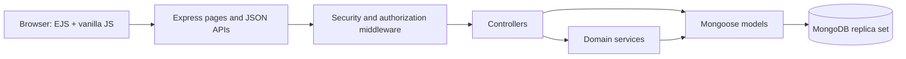
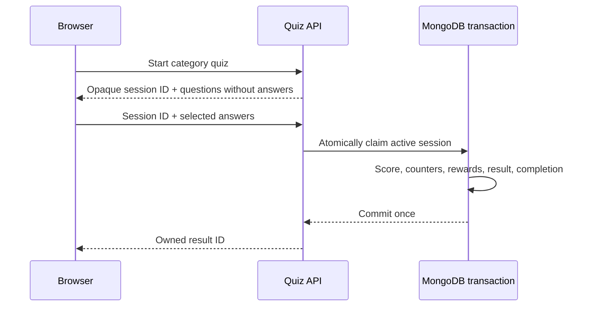

# QuizMaster Pro

QuizMaster Pro is a secure full-stack quiz platform built with Express, EJS, vanilla JavaScript, and MongoDB. It combines a responsive learner experience with administrator content management, analytics, reporting, and a transaction-safe quiz engine.

**Status:** local v1.0.0 release candidate. This repository is a portfolio project, not a hosted public service.

## Highlights

### Learner experience

- Registration, email verification, login, recovery, and session-aware account security
- Category-based quizzes with server-issued, expiring sessions
- Daily challenges, XP, levels, streaks, achievements, and notifications
- Owned result review, history, leaderboard, and performance analytics
- Profile, avatar, account settings, and password management
- Responsive dark UI for desktop, tablet, and mobile

### Administrator experience

- Dashboard statistics and analytics
- Question and category management
- User role/status management with session revocation
- Attempt review, achievements, notifications, reports, and activity logs
- Platform settings with administrator-only authorization

### Security and integrity

- HS256 JWTs with issuer, audience, expiry, and per-user token version
- HttpOnly, SameSite cookies and exact-origin mutation checks
- Server-authoritative question sets and atomic `active → processing → completed` claims
- MongoDB transactions for score, XP, counters, daily completion, achievements, and notifications
- Replay/concurrency protection with unique indexes and deterministic conflicts
- Ownership-scoped results and notifications
- Active-question enforcement with historical-session compatibility
- CSP, request-key hardening, rate limits, upload signature/dimension checks
- Same-origin notification links and spreadsheet-safe CSV encoding

## Technology

| Layer          | Technology                                         |
| -------------- | -------------------------------------------------- |
| Server         | Node.js, Express, EJS                              |
| Database       | MongoDB, Mongoose, replica-set transactions        |
| Browser        | Semantic HTML, CSS, vanilla JavaScript             |
| Authentication | JWT, bcrypt, HttpOnly cookies                      |
| Integrations   | Nodemailer SMTP, optional Cloudinary avatars       |
| Tests          | Jest, Supertest, mongodb-memory-server, Playwright |
| Quality        | ESLint, Prettier, npm audit, GitHub Actions        |

## Architecture



Quiz submission is deliberately server-authoritative:



See [Architecture](docs/ARCHITECTURE.md) for current boundaries and data flows.

## Repository structure

```text
client/views/       EJS pages and partials
client/js/          Page behavior and shared browser utilities
client/css/         Design foundations and page-specific styles
server/routes/      HTTP method/path and middleware contracts
server/controllers/ Validation and response coordination
server/services/    Reusable domain workflows and integrations
server/models/      Mongoose schemas, validation, and indexes
server/middleware/  Authentication, security, uploads, and errors
server/utils/       JWT, CSV, URL, normalization, and pagination helpers
server/database/    Explicit question seed/reset scripts
tests/              Jest unit, contract, and MongoDB integration suites
e2e/                Playwright desktop/mobile audits
docs/               Architecture, API, security, testing, and review guides
```

## Prerequisites

- Node.js 22 or newer (`24.x` is used by the quality workflow)
- npm
- MongoDB 8-compatible server configured as a replica set
- Chromium for Playwright tests

MongoDB transactions are required for quiz completion. A standalone MongoDB instance can render pages but cannot safely complete quizzes.

## Local installation

```bash
git clone https://github.com/Ashish-Vision/QuizMaster-Pro.git
cd QuizMaster-Pro
npm ci
cp .env.example .env
```

Edit `.env` using [Environment configuration](docs/ENVIRONMENT.md). Never commit `.env`.

Start or initialize a local MongoDB replica set, then optionally seed the question collection:

```bash
npm run seed:questions
npm run dev
```

Open `http://localhost:5000`.

`npm run reset:questions` replaces the question collection and is intentionally explicit. Use it only with a disposable local database.

## First administrator

Register and verify a normal account. In your local MongoDB instance, change that account’s `role` from `user` to `admin`, then log in again so authorization is evaluated through a fresh token. The application intentionally has no public “create admin” endpoint.

## Commands

| Command                    | Purpose                                     |
| -------------------------- | ------------------------------------------- |
| `npm run dev`              | Start with Nodemon                          |
| `npm start`                | Start the application normally              |
| `npm run seed:questions`   | Seed questions into an empty/local database |
| `npm run reset:questions`  | Replace local question data                 |
| `npm run check`            | Syntax, lint, formatting, and Jest          |
| `npm test`                 | Complete Jest suite                         |
| `npm run test:integration` | MongoDB integration suites                  |
| `npm run test:coverage`    | Jest coverage report                        |
| `npm run test:e2e`         | Desktop/mobile Chromium                     |
| `npm run format`           | Apply Prettier                              |
| `npm run audit:prod`       | Production dependency audit                 |

The current validated baseline is 230 Jest tests and 26 Playwright checks. Fresh complete-server coverage is 57.22% statements, 34.70% branches, 51.81% functions, and 57.24% lines; critical routes, models, utilities, quiz integrity, analytics, leaderboard, and achievement paths are substantially higher. See [Testing](docs/TESTING.md).

## API overview

JSON APIs are grouped under `/api/auth`, `/api/quiz`, `/api/daily-challenge`, user feature prefixes, and `/api/admin/*`. Protected APIs accept the authentication cookie; administrators additionally require the current user role. See [API reference](docs/API.md).

## Screenshots and media

Screenshots are intentionally not fabricated. Follow [the screenshot guide](docs/SCREENSHOT_GUIDE.md) and add reviewed images under:

- `docs/images/user/`
- `docs/images/admin/`
- `docs/images/architecture/`

A short demo GIF or video can be linked here after it is recorded from the local application with synthetic data.

## Known limitations

- This is a local portfolio release candidate, not a production-certified service.
- Rate limiting is process-local.
- Daily challenge completions are embedded and intended for portfolio-scale data.
- CSV reports are memory-buffered and offset pagination is used.
- SMTP and Cloudinary flows require optional external credentials and are mocked in automation.
- Automated browser coverage currently targets Chromium; manual screen-reader testing remains recommended.
- The repository owner must still choose and add a LICENSE file. Package publication is disabled until then.

## Future improvements

- Cursor pagination and streamed bounded reports
- Broader direct coverage of large administrator/profile controllers
- Decode/re-encode avatar processing and metadata stripping verification
- Firefox/WebKit and dedicated assistive-technology testing
- Further incremental replacement of legacy escaped HTML templates with DOM construction

## Contributing and security

Read [CONTRIBUTING.md](CONTRIBUTING.md) before opening a pull request. Report security concerns using [SECURITY.md](SECURITY.md), without placing secrets or private user data in a public issue.

## License and author

Copyright remains with the repository owner. No open-source license has been selected yet; see the release checklist before publishing or inviting reuse.

Maintained by [Ashish-Vision](https://github.com/Ashish-Vision).
